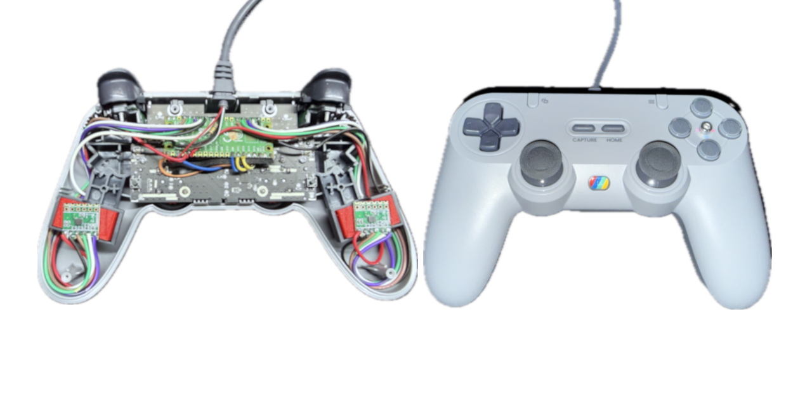

# Alpakka Lite
Add *Dual-gyro* and *Thumb-sense* (gyro on/off) to a regular wired XInput gamepad to build an [Input Labs Alpakka](https://inputlabs.io/alpakka) compatible gyro game controller from mostly off-the-shelf components.

### Features:
- Lightweight (150g)
- Alpakka compatible firmware, fully configurable with <a href="https://ctrl.inputlabs.io/" target="_blank">ctrl.inputlabs.io</a>
- Dual SPI channel support for gyros
- LSM6DS3 IMU support (cheaper and more available breakout boards than LSM6DSV)
- Capacitive touch gyro on/off
- USB host "passthrough" for XInput Gamepads
- Paddles, capture, and mode buttons working (_only supported for Tegenaria controller_)

## Disclaimer
_This project is an independent initiative and is not affiliated with, endorsed by, sponsored by, or otherwise officially connected to Input Labs Oy. All trademarks and registered trademarks are the property of their respective owners._
